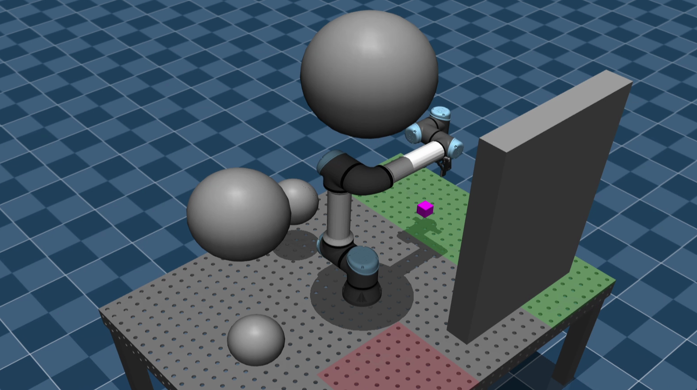

## UR5_RRT_Planning

## Overview
This project demonstrates collision-free planning using the UR5 robot arm in MuJoCo, utilizing `RRT`.

## Changelog
- Add gripper and object collision for path planning.

## Workspace

## Environment
- pin: 2.6.20
- numpy: 1.24.3
- torch: 2.5.1+cu118
- pyroboplan: 1.3.0
- mujoco: 3.3.6

## Acknowledgements
- This repo is adapted from [UR3e_AG95_Grasp_public](https://github.com/hangtingLiu/UR3e_AG95_Grasp_public.git), submodules from [manipulator_grasp](https://gitee.com/chaomingsanhua/manipulator_grasp.git) and [graspnet-baseline](https://github.com/graspnet/graspnet-baseline). Thank the authors and contributors for open-sourcing their code.

## License
MIT